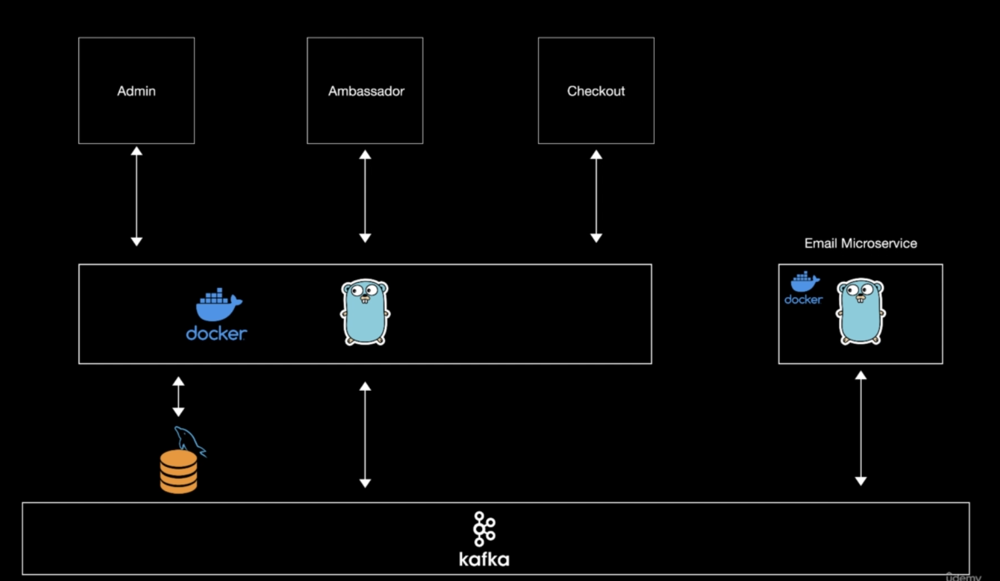

This project demonstrates a microservices-based architecture designed with scalability and modularity in mind. The system is containerized with Docker and leverages Apache Kafka for asynchronous messaging between services.

Services
Admin, Ambassador, and Checkout Frontends:
Interface layers interacting with the core application logic.

Core Application Service (Go + Docker):
Central backend logic written in Go, containerized using Docker. It handles data persistence via MySQL and communicates with other microservices through Kafka.

Email Microservice (Go + Docker):
A dedicated service for sending transactional emails. It consumes messages from Kafka to trigger email events asynchronously.

Integration
Database: MySQL is used for structured data storage.

Kafka: Manages asynchronous communication between services, ensuring loose coupling and high throughput.

Docker: All services are containerized for easier deployment and consistency across environments.

